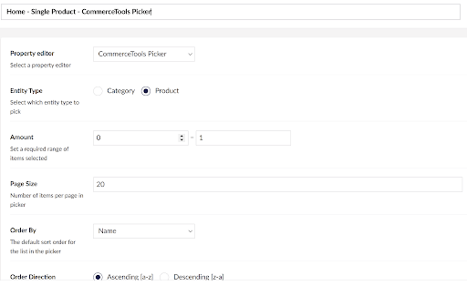

# Umbraco.Cms.Integrations.Commerce.Hubspot

This integration provides a product and category picker, with data sourced from a [CommerceTools](https://commercetools.com/) installation.

## Prerequisites

Requires minimum versions of Umbraco CMS: 8.5.0

## How To Use

From your CommerceTools account, retrieve the following details add them as application settings to your websites web.config file.

```
<add key="Umbraco.Cms.Integrations.Commerce.CommerceTools.OAuthUrl" value="https://auth.europe-west1.gcp.commercetools.com/oauth/token" />
<add key="Umbraco.Cms.Integrations.Commerce.CommerceTools.ApiUrl" value="https://api.europe-west1.gcp.commercetools.com" />
<add key="Umbraco.Cms.Integrations.Commerce.CommerceTools.ProjectKey" value="" />
<add key="Umbraco.Cms.Integrations.Commerce.CommerceTools.ClientId" value="" />
<add key="Umbraco.Cms.Integrations.Commerce.CommerceTools.ClientSecret" value="" />
<add key="Umbraco.Cms.Integrations.Commerce.CommerceTools.DefaultLanguage" value="en-US" />
```

With that in place, in the Umbraco back-office click to _Settings > Data Types_ and create a new data type based on the available *CommerceTools Picker*.

The picker can be configured for selection of categories or products, defined as single or multiple picker, as well as other options:



When rendering product or category information, a property value converter will provide a strongly typed collection or object with the following fields available:

- [Category](./Models/Category.cs)
- [Product](./Models/Product.cs)


